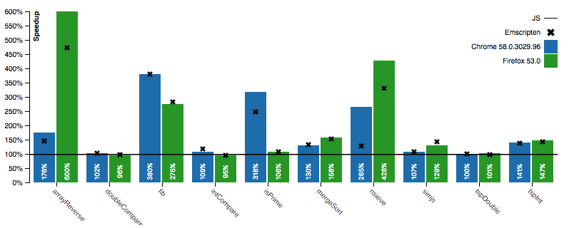

# Speedy.js

[](https://travis-ci.com/MichaReiser/speedy.js)

Speedy.js is a compiler for a well considered, performance pitfalls free subset of JavaScript targeting WebAssembly. Because WebAssembly is statically-typed, the project uses TypeScript as type-checker and to resolve the types of the program symbols. 

The project is very experimental and still far away from being production ready. 
 
## Prerequisites 

1. A lot of disk space (~20gb)
2. A lot of ram (~4gb)
3. A lot of patience
4. Up to date C++ compiler, and other build essentials (see [LLVM requirements](http://llvm.org/docs/GettingStarted.html#requirements))

These requirements will change as soon as the WebAssembly backend for LLVM is no longer experimental and 
included in your platforms build by default.

There is also a pre-build [Ubuntu VM](https://drive.switch.ch/index.php/s/niYl4khM4Q2cX1z) (user: speedyjs, password: welcome) that can be used to experiment with the compiler.

## Getting started

Clone the git repository:

```
git clone --recursive https://github.com/MichaReiser/speedy.js.git
```

Run the `install` and `bootstrap` scripts in the just cloned directory:

```
npm install
npm run bootstrap
```

The bootstrap script is going to take a while as it clones the latest version of LLVM and clang and builds them from source. So it's best if you take a nap, do your groceries...

Alternatively, LLVM and clang can be [built manually](http://llvm.org/docs/CMake.html) from source including the flag `-DLLVM_EXPERIMENTAL_TARGETS_TO_BUILD=WebAssembly`. The `npm run bootstrap` script will pick up your LLVM installation if you set the `LLVM` environment variable.

```
LLVM=/usr/local/bin npm run bootstrap
```

## Compile your first Script
You have to mark Speedy.js functions with the `use speedyjs` directive. Furthermore, you have to declare Speedy.js functions that are called from a pure JavaScript function as `async` (see `fib`). 

fib.ts:

```typescript
async function fib(value: int): Promise<int> {
    "use speedyjs";

    return fibSync(value);
}

function fibSync(value: int): int {
    "use speedyjs";

    if (value <= 2) {
        return 1;
    }

    return fibSync(value - 2) + fibSync(value - 1);
}

async function main() {
    console.log(await fib(40));
}
```

The compiler will compile the `fib` and `fibSync` function to WebAssembly whereas the `main` function remains in pure JS. 

The script can be compiled using:

```
node packages/compiler/cli.js fib.ts
```

which outputs the `fib.js` file. 

To compile all files in the current directory omit any file names or pass multiple file names to the CLI. More details about how to use the CLI is documented in [the wiki](https://github.com/MichaReiser/speedy.js/wiki/CLI).

## WebPack Loader

The package `loader` contains a WebPack loader implementation. See `packages/benchmark/webpack.config.js` for more details.

## Benchmark

